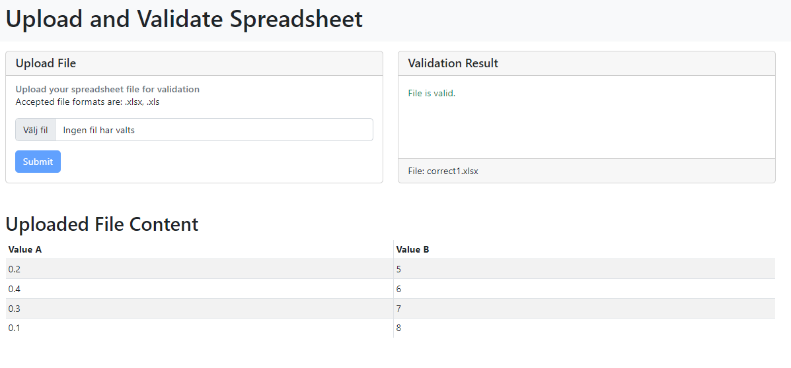
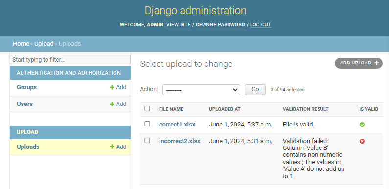

# Spreadsheet Verification

A web interface for uploading `.xlsx` files and verifying their content.

<div style="border: 1px solid black; padding: 5px; display: inline-block;">
    
</div>

***

## Running the Server

To run the Django backend, follow these steps:

1. Open a terminal inside the project directory (`spreadsheet_verification`).
2. Type the following command:

```bash
python manage.py runserver
```
***
## Updates
To apply changes and updates, perform the following steps:

Open a terminal inside the project directory (spreadsheet_verification).
Run the following commands:

```bash
python manage.py makemigrations
python manage.py migrate
```
***
## File Storage
By default, Django uses SQLite for its database, suitable for development and testing purposes. The database file (db.sqlite3) will be created in the root directory of the project.

Database Configuration (settings.py)
```bash
DATABASES = {
    'default': {
        'ENGINE': 'django.db.backends.sqlite3',
        'NAME': BASE_DIR / 'db.sqlite3',
    }
}
```
***

## Admin Panel

<div style="border: 1px solid black; padding: 5px; display: inline-block;">
    
</div>


To access the admin panel, you need to create a superuser account:

Open a terminal inside the project directory (spreadsheet_verification).
Run the following command and follow the prompts:
```bash
python manage.py createsuperuser
```

Provide the requested information:

- Username
- Email
- Password

## Dependencies
See requirements.txt

## Testing
Not implemented yet.

## License
This project is open-source and available under the MIT License.
